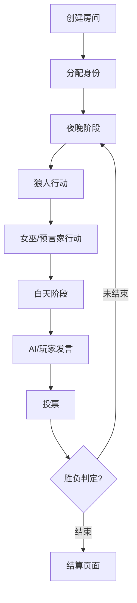

好的，以下是基于 **Flutter + FastAPI（异步后端）** 架构的 **AI 狼人杀游戏完整开发计划方案**，涵盖前后端架构、AI 逻辑、通信机制、数据库、项目阶段与任务分解，适用于中大型团队执行。

---

## 🧩 一、项目总体目标

构建一款 **跨平台 AI 狼人杀游戏**，支持：

- Flutter 前端（Android / iOS / Web）；
- FastAPI 异步后端（高并发实时处理）；
- WebSocket 实时通信；
- AI 玩家（GPT 模型推理 + 个性发言生成）；
- 语音系统与自动结算；
- 跨平台联机、观战与 AI 个性化对战。

---

## 🏗️ 二、总体架构设计

### 1. 架构概览

```
Flutter Client  ⇄  FastAPI Backend  ⇄  PostgreSQL / Redis  ⇄  AI 模型服务(GPT)
                         ↑
                     WebSocket 实时通信
                         ↓
                    Agora / WebRTC (语音)
```

### 2. 技术选型

| 模块     | 技术                                | 说明                                     |
| -------- | ----------------------------------- | ---------------------------------------- |
| 前端     | Flutter 3.x + Riverpod              | 多端统一 UI 框架，使用状态管理           |
| 后端     | **FastAPI（异步）**                 | 高性能、支持 WebSocket、API 文档自动生成 |
| 实时通信 | WebSocket (Starlette 内置支持)      | 异步房间广播、消息同步                   |
| AI 模块  | GPT-4/5 / 本地 LLM (LangChain 整合) | 发言生成、推理分析、决策控制             |
| 数据库   | PostgreSQL + SQLAlchemy (async)     | 游戏数据与日志存储                       |
| 缓存     | Redis                               | 房间状态与 AI 上下文缓存                 |
| 语音模块 | Agora / WebRTC                      | 实时语音通话与 TTS 播放                  |
| 部署     | Docker + Nginx + uvicorn            | 支持水平扩展与容器化部署                 |

---

## 🎮 三、核心功能模块

### 1. 游戏大厅与房间管理

- **创建/加入房间**（支持房主设置模式、AI 补位）
- **房间广播机制**（玩家加入/退出/准备）
- **房间状态实时同步**（使用 WebSocket 群发）

### 2. 游戏核心流程

阶段控制由 FastAPI 后端统一调度：

| 阶段     | 功能描述                                   |
| -------- | ------------------------------------------ |
| 初始化   | 随机身份分配（狼人/预言家/女巫/猎人/平民） |
| 夜晚阶段 | 狼人选择击杀对象、女巫使用药剂、预言家验人 |
| 白天阶段 | 公示结果、玩家发言、投票放逐               |
| 结算阶段 | 统计胜负结果并记录战绩                     |

所有动作（发言、技能、投票）通过异步事件广播实现实时同步。

### 3. AI 玩家系统

AI 模块具备以下能力：

| 模块     | 功能                                   | 技术             |
| -------- | -------------------------------------- | ---------------- |
| 发言生成 | 结合当前局势与身份生成逻辑发言         | GPT + Prompt     |
| 推理判断 | 通过历史发言和行为分析阵营             | LangChain Memory |
| 策略决策 | 选择击杀目标或投票对象                 | 自定义推理模块   |
| 个性模拟 | 各 AI 拥有性格模型（激进/谨慎/迷惑型） | 角色参数建模     |

AI 调用示例：

```python
prompt = f"""
你是一名狼人杀玩家。身份：{role}。
当前阶段：{phase}。
局势：
{game_state}

请以自然语言生成一段发言，包含推理、立场和情绪，长度约30秒。
"""
```

FastAPI 提供 `/ai/generate_speech` 接口异步调用 AI 并返回发言内容。

---

## 🧠 四、后端逻辑与通信机制

### 1. 异步 WebSocket 架构

- 使用 FastAPI 的 `WebSocketRoute`；
- 每个房间一个 `RoomManager`；
- 使用 Redis Pub/Sub 实现分布式广播；
- 消息类型：

  - `state_update`
  - `chat_message`
  - `vote_event`
  - `system_log`

### 2. 异步任务与调度

- `asyncio.create_task()` 管理阶段定时；
- 使用 `APScheduler` 定时控制阶段切换；
- 所有长耗时任务（AI 请求）异步执行，避免阻塞主线程。

---

## 🧾 五、数据库与数据模型

### 1. 表结构设计（PostgreSQL）

| 表名        | 描述                             |
| ----------- | -------------------------------- |
| users       | 玩家账号、等级、积分             |
| rooms       | 房间 ID、状态、玩家列表          |
| games       | 游戏局信息（阶段、回合数、胜负） |
| actions     | 玩家操作记录（投票、技能使用）   |
| ai_profiles | AI 角色信息、性格参数            |
| logs        | 系统日志与调试信息               |

### 2. 模型定义（示例）

```python
class Game(Base):
    __tablename__ = "games"
    id = Column(Integer, primary_key=True)
    status = Column(String)
    round = Column(Integer)
    players = Column(JSON)
    created_at = Column(DateTime, default=datetime.utcnow)
```

---

## 🎨 六、前端 Flutter 模块划分

| 模块                               | 描述                                 |
| ---------------------------------- | ------------------------------------ |
| `/screens/lobby.dart`              | 游戏大厅、房间列表                   |
| `/screens/game.dart`               | 主游戏界面                           |
| `/screens/voice_chat.dart`         | 语音功能界面                         |
| `/providers/`                      | 状态管理（Riverpod）                 |
| `/services/websocket_service.dart` | WebSocket 客户端                     |
| `/services/api_client.dart`        | REST API 客户端                      |
| `/widgets/`                        | 公共 UI 组件（玩家头像、投票按钮等） |

### 游戏 UI 层次结构

- 顶部：阶段提示 + 倒计时；
- 中部：玩家头像阵列（状态同步）；
- 下方：发言区 / 操作按钮；
- 弹窗：技能面板、投票选择、系统提示。

---

## ⚙️ 七、开发阶段与任务分解

| 阶段               | 时间 | 主要任务                                         |
| ------------------ | ---- | ------------------------------------------------ |
| 阶段 1：原型设计   | 1 周 | Figma 原型、UI 规范、接口草案                    |
| 阶段 2：框架搭建   | 2 周 | Flutter 项目结构、FastAPI 架构搭建、数据库初始化 |
| 阶段 3：房间系统   | 2 周 | 用户登录、创建/加入房间、WebSocket 通信          |
| 阶段 4：游戏逻辑   | 3 周 | 阶段控制、身份逻辑、状态同步                     |
| 阶段 5：AI 模块    | 3 周 | GPT 集成、LangChain 记忆模块、AI 发言逻辑        |
| 阶段 6：UI 优化    | 2 周 | 动画、语音界面、AI 语音播放                      |
| 阶段 7：测试与部署 | 2 周 | 压测、Docker 部署、CDN 加速、上线                |

---

## 🔌 八、API 接口定义示例

```python
# WebSocket 连接
@router.websocket("/ws/{room_id}")
async def websocket_endpoint(websocket: WebSocket, room_id: str):
    await manager.connect(websocket, room_id)
    try:
        while True:
            data = await websocket.receive_json()
            await manager.broadcast(data, room_id)
    except WebSocketDisconnect:
        manager.disconnect(websocket, room_id)

# AI 发言接口
@router.post("/ai/generate_speech")
async def generate_speech(request: AIRequest):
    response = await ai_service.generate_text(request.context)
    return {"speech": response}
```

---

## 🚀 九、扩展功能规划

- 🧩 **AI 学习记忆**：AI 通过多局记录学习玩家风格；
- 🎙️ **语音识别 + 推理结合**：AI 分析真实语音；
- 📊 **观战分析模式**：实时展示 AI 推理权重；
- 🕹️ **跨端联机**：Web + App 同房；
- 🧍‍♂️ **AI 人格系统**：通过性格参数生成不同风格发言。

---

## 📅 十、项目管理建议

| 工具              | 用途           |
| ----------------- | -------------- |
| GitHub + Actions  | CI/CD 自动部署 |
| Notion / Jira     | 任务与阶段管理 |
| Figma             | 界面设计       |
| Postman / Swagger | 接口文档管理   |
| Docker Compose    | 一键部署环境   |

---

## ✅ 结语

本方案以 **Flutter + FastAPI 异步架构** 为核心，兼顾高性能、实时性与 AI 可扩展性。
通过模块化设计与异步处理机制，系统可在高并发下保持流畅，并支持未来接入更智能的 AI 推理与语音互动。

完美 👍
以下是完整交付内容，分为两大部分：

1. **FastAPI 异步后端的 OpenAPI 标准接口文档模板（详细）**
2. **模块级 Flutter + FastAPI 项目任务清单（含文件结构、职责与交付物）**

整个方案是可直接投入团队开发的蓝图级设计文档。

---

# 🧭 一、FastAPI 异步后端 OpenAPI 接口文档模板

## 1. 系统概述

后端服务采用 **FastAPI 异步架构**，提供以下核心服务：

- **用户服务**（注册、登录、资料）
- **房间服务**（创建/加入/退出房间）
- **游戏服务**（阶段控制、状态同步）
- **AI 服务**（发言生成、推理决策）
- **语音服务**（WebRTC/Agora 连接信息）
- **WebSocket 实时通信**

接口返回均采用统一响应体：

```json
{
  "code": 200,
  "message": "success",
  "data": {}
}
```

---

## 2. API 分组与详细定义

### 🧑 用户模块 `/api/user/`

#### 1. 注册

- **POST** `/api/user/register`
- **请求体：**

```json
{
  "username": "player01",
  "email": "test@example.com",
  "password": "123456"
}
```

- **响应：**

```json
{
  "code": 200,
  "message": "registered",
  "data": {
    "user_id": 1,
    "token": "jwt-token"
  }
}
```

#### 2. 登录

- **POST** `/api/user/login`
- **请求体：**

```json
{
  "email": "test@example.com",
  "password": "123456"
}
```

- **响应：**

```json
{
  "code": 200,
  "data": {
    "token": "jwt-token",
    "user_id": 1
  }
}
```

#### 3. 用户信息

- **GET** `/api/user/me`
- **Headers：**

  - `Authorization: Bearer {jwt}`

- **响应：**

```json
{
  "code": 200,
  "data": {
    "id": 1,
    "username": "player01",
    "level": 3,
    "games_played": 42
  }
}
```

---

### 🏠 房间模块 `/api/room/`

#### 1. 创建房间

- **POST** `/api/room/create`
- **请求体：**

```json
{
  "room_name": "狼人杀之夜",
  "max_players": 9,
  "with_ai": true
}
```

- **响应：**

```json
{
  "code": 200,
  "data": {
    "room_id": "abc123",
    "players": [],
    "status": "waiting"
  }
}
```

#### 2. 加入房间

- **POST** `/api/room/join`
- **请求体：**

```json
{
  "room_id": "abc123",
  "user_id": 1
}
```

#### 3. 获取房间信息

- **GET** `/api/room/{room_id}`
- **响应：**

```json
{
  "data": {
    "room_id": "abc123",
    "status": "waiting",
    "players": [
      { "id": 1, "name": "player01" },
      { "id": 2, "name": "AI_01" }
    ]
  }
}
```

#### 4. 退出房间

- **POST** `/api/room/leave`

```json
{
  "room_id": "abc123"
}
```

---

### 🎮 游戏模块 `/api/game/`

#### 1. 启动游戏

- **POST** `/api/game/start`

```json
{
  "room_id": "abc123"
}
```

返回：

```json
{
  "data": {
    "game_id": "g123",
    "phase": "night",
    "roles_assigned": true
  }
}
```

#### 2. 提交行动

- **POST** `/api/game/action`

```json
{
  "game_id": "g123",
  "player_id": 1,
  "action": "vote",
  "target": 3
}
```

#### 3. 获取当前状态

- **GET** `/api/game/status/{game_id}`

```json
{
  "data": {
    "phase": "day",
    "round": 3,
    "alive_players": [1, 2, 5, 7]
  }
}
```

---

### 🧠 AI 模块 `/api/ai/`

#### 1. 生成发言

- **POST** `/api/ai/speech`

```json
{
  "role": "狼人",
  "phase": "白天发言",
  "context": "3号被杀，5号验人结果是好人"
}
```

- **响应：**

```json
{
  "data": {
    "speech": "我觉得5号太稳了，可能是狼。昨晚刀3号是陷阱。",
    "confidence": 0.82
  }
}
```

#### 2. 投票决策

- **POST** `/api/ai/vote`

```json
{
  "context": {
    "remaining_players": [1, 2, 3, 4, 5],
    "history": ["2号发言激进", "4号被票出"]
  }
}
```

- **响应：**

```json
{
  "data": { "target": 3, "reason": "嫌疑较大" }
}
```

---

### 🔊 语音模块 `/api/voice/`

#### 获取语音频道 Token

- **GET** `/api/voice/token?room_id=abc123`

```json
{
  "data": {
    "channel": "abc123",
    "token": "agora-token"
  }
}
```

---

### 🔄 WebSocket 实时通信 `/ws/{room_id}`

**消息格式：**

```json
{
  "type": "state_update",
  "data": {
    "phase": "night",
    "current_speaker": 4
  }
}
```

---

# 🧩 二、模块级任务分解与文件结构

## 1. Flutter 前端

### 🗂️ 文件结构

```
lib/
 ├── main.dart
 ├── screens/
 │    ├── login.dart
 │    ├── lobby.dart
 │    ├── room.dart
 │    ├── game.dart
 ├── services/
 │    ├── api_client.dart
 │    ├── websocket_service.dart
 │    ├── voice_service.dart
 ├── providers/
 │    ├── game_state_provider.dart
 │    ├── user_provider.dart
 ├── models/
 │    ├── user.dart
 │    ├── room.dart
 │    ├── game.dart
 ├── widgets/
 │    ├── player_card.dart
 │    ├── chat_bubble.dart
 │    ├── timer.dart
```

### 📋 开发任务表

| 模块        | 开发内容                   | 负责人 | 周期 |
| ----------- | -------------------------- | ------ | ---- |
| 登录注册    | 用户界面、API 接入         | 前端 1 | 1 周 |
| 游戏大厅    | 房间列表、创建、加入       | 前端 2 | 2 周 |
| 游戏 UI     | 显示阶段、发言区、动画效果 | 前端 1 | 3 周 |
| WebSocket   | 实时通信客户端封装         | 前端 3 | 1 周 |
| AI 发言展示 | AI 消息动态渲染            | 前端 2 | 1 周 |
| 语音模块    | Agora SDK 集成、语音按钮   | 前端 3 | 2 周 |

---

## 2. FastAPI 后端

### 🗂️ 文件结构

```
backend/
 ├── main.py
 ├── routers/
 │    ├── user.py
 │    ├── room.py
 │    ├── game.py
 │    ├── ai.py
 │    ├── voice.py
 ├── core/
 │    ├── config.py
 │    ├── database.py
 │    ├── websocket_manager.py
 ├── models/
 │    ├── user.py
 │    ├── game.py
 │    ├── room.py
 ├── services/
 │    ├── ai_service.py
 │    ├── game_logic.py
 │    ├── voice_service.py
 ├── schemas/
 │    ├── user.py
 │    ├── room.py
 │    ├── game.py
 ├── tests/
 │    ├── test_game.py
 │    ├── test_ai.py
```

### 📋 开发任务表

| 模块       | 功能                   | 技术重点                   | 负责人 | 周期 |
| ---------- | ---------------------- | -------------------------- | ------ | ---- |
| 用户模块   | 登录/注册/JWT 验证     | FastAPI + JWT + SQLAlchemy | 后端 1 | 1 周 |
| 房间模块   | 房间创建、加入、退出   | 异步 ORM + Redis 缓存      | 后端 2 | 2 周 |
| 游戏逻辑   | 阶段流转、投票逻辑     | asyncio + 状态机           | 后端 2 | 3 周 |
| AI 模块    | GPT 对话接口、策略推理 | LangChain + Async HTTPX    | 后端 3 | 2 周 |
| WebSocket  | 实时通信               | FastAPI + Redis Pub/Sub    | 后端 1 | 2 周 |
| 语音模块   | Agora Token 分发       | REST 接口                  | 后端 3 | 1 周 |
| 测试与部署 | Docker 化、CI/CD       | GitHub Actions + pytest    | 全组   | 1 周 |

---

## 3. 数据与 AI 支撑模块

| 模块        | 内容                     | 技术栈                   |
| ----------- | ------------------------ | ------------------------ |
| 记忆管理    | 保存 AI 发言与上下文     | Redis + LangChain Memory |
| Prompt 模板 | 不同身份模板             | YAML + Jinja2 渲染       |
| 决策训练    | 收集历史数据强化 AI 逻辑 | Python + RLHF（可选）    |

---

## 4. 项目时间线（甘特图建议）

| 阶段   | 时间        | 主要目标               |
| ------ | ----------- | ---------------------- |
| 阶段 1 | 第 1-2 周   | 原型、架构搭建         |
| 阶段 2 | 第 3-5 周   | 用户/房间系统完成      |
| 阶段 3 | 第 6-8 周   | 游戏逻辑与 AI 核心上线 |
| 阶段 4 | 第 9-10 周  | UI 完善 + 语音系统接入 |
| 阶段 5 | 第 11-12 周 | 压测、优化、发布 Beta  |

非常好 👏
下面是完整的 **Flutter 客户端开发蓝图方案**，与之前的 **FastAPI 异步后端架构** 完全配套。
包含：

1. 🏗️ Flutter 项目整体架构与依赖
2. 📱 模块划分与文件结构
3. 🔌 与 FastAPI 的接口通信设计
4. 🔄 WebSocket 实时通信实现
5. 🧠 AI 发言/游戏逻辑 UI 流程
6. 📋 详细任务分解（开发者级别）
7. 🚀 构建与部署方案

---

# 🏗️ 一、Flutter 客户端架构设计

### 📦 技术选型

| 模块     | 技术                       | 说明                  |
| -------- | -------------------------- | --------------------- |
| 框架     | Flutter 3.x (Dart 3+)      | 跨平台核心            |
| 状态管理 | Riverpod / StateNotifier   | 轻量、响应式状态管理  |
| 网络通信 | Dio + WebSocketChannel     | 兼容 REST + WS        |
| 实时通信 | WebSocket (FastAPI 对接)   | 游戏状态同步          |
| 本地缓存 | SharedPreferences / Hive   | 存储 token 与用户配置 |
| 语音模块 | Agora Flutter SDK / WebRTC | 实时语音通话          |
| 动画     | Flutter Animate / Lottie   | 游戏阶段、发言动画    |
| AI 接口  | 调用 FastAPI `/api/ai/...` | GPT 发言接入          |
| UI 框架  | Material 3 + Rive 动画     | 现代风格与交互感      |

---

# 📂 二、项目结构设计

```
lib/
├── main.dart
├── core/
│   ├── config.dart             # 常量、服务器地址
│   ├── logger.dart             # 日志与调试
│   ├── theme.dart              # 统一主题
│
├── models/
│   ├── user.dart
│   ├── room.dart
│   ├── game.dart
│   ├── ai_speech.dart
│
├── services/
│   ├── api_client.dart         # 与 FastAPI REST 通信
│   ├── websocket_service.dart  # WebSocket 管理
│   ├── voice_service.dart      # Agora/WebRTC 管理
│
├── providers/
│   ├── user_provider.dart      # 用户状态管理
│   ├── room_provider.dart      # 房间状态
│   ├── game_provider.dart      # 游戏状态、阶段控制
│   ├── ai_provider.dart        # AI 发言与决策状态
│
├── screens/
│   ├── login_screen.dart
│   ├── lobby_screen.dart
│   ├── room_screen.dart
│   ├── game_screen.dart
│   ├── speech_screen.dart
│
├── widgets/
│   ├── player_card.dart
│   ├── chat_bubble.dart
│   ├── countdown_timer.dart
│   ├── action_button.dart
│   ├── voice_button.dart
│
└── utils/
    ├── formatter.dart
    ├── sound_manager.dart
    ├── animation_helper.dart
```

---

# 🔌 三、API 通信与封装

### REST API 通信

使用 Dio 封装 FastAPI 接口，统一管理：

```dart
class ApiClient {
  final Dio _dio = Dio(BaseOptions(baseUrl: "https://api.yourdomain.com/api"));

  Future<Response> login(String email, String password) async {
    return await _dio.post('/user/login', data: {
      'email': email,
      'password': password,
    });
  }

  Future<Response> createRoom(String name, int maxPlayers) async {
    return await _dio.post('/room/create', data: {
      'room_name': name,
      'max_players': maxPlayers,
    });
  }

  Future<Response> aiSpeech(String role, String phase, String context) async {
    return await _dio.post('/ai/speech', data: {
      'role': role,
      'phase': phase,
      'context': context,
    });
  }
}
```

---

# 🔄 四、WebSocket 实时通信

游戏过程中通过 WebSocket 实时同步状态（房间、发言、投票等）：

```dart
class WebSocketService {
  WebSocketChannel? _channel;

  void connect(String roomId) {
    _channel = WebSocketChannel.connect(Uri.parse('wss://api.yourdomain.com/ws/$roomId'));
    _channel!.stream.listen((message) {
      final data = jsonDecode(message);
      _handleMessage(data);
    });
  }

  void sendAction(Map<String, dynamic> action) {
    _channel?.sink.add(jsonEncode(action));
  }

  void _handleMessage(Map<String, dynamic> data) {
    switch (data['type']) {
      case 'state_update':
        gameProvider.updateState(data['data']);
        break;
      case 'chat_message':
        chatProvider.addMessage(data['data']);
        break;
    }
  }

  void disconnect() {
    _channel?.sink.close();
  }
}
```

---

# 🧠 五、游戏与 AI 发言流程

### 1. 游戏阶段流程



### 2. AI 发言展示

1. 前端监听 `ai_provider`；
2. 调用 `/api/ai/speech`；
3. 播放文本与语音（TTS）；
4. 渲染动态气泡 + 玩家头像高亮；
5. 倒计时结束自动切换下一个发言者。

---

# 🎨 六、UI/UX 关键交互

| 界面      | 功能                    | 交互说明                 |
| --------- | ----------------------- | ------------------------ |
| 登录页    | 用户输入、验证          | 带登录加载动画           |
| 大厅页    | 房间列表/创建按钮       | 实时刷新房间人数         |
| 房间页    | 等待玩家、准备按钮      | 房主可添加 AI            |
| 游戏页    | 阶段切换动画            | 高亮发言玩家、显示计时条 |
| AI 发言区 | 动态文字气泡 + 声音同步 | AI 语音播放与动画同步    |
| 投票页    | 玩家选择投票目标        | 倒计时+自动提交          |
| 结算页    | 显示胜负/AI 推理摘要    | 支持分享与重开           |

---

# ⚙️ 七、Flutter 模块任务分解

| 模块        | 任务                         | 技术重点                    | 负责人 | 周期 |
| ----------- | ---------------------------- | --------------------------- | ------ | ---- |
| 登录注册    | 用户界面、表单校验、Dio 封装 | Material UI + Dio           | 前端 1 | 1 周 |
| 大厅系统    | 房间列表、刷新、创建         | Riverpod 状态管理           | 前端 2 | 2 周 |
| 房间逻辑    | WebSocket 实时同步、AI 加入  | WebSocketChannel            | 前端 1 | 2 周 |
| 游戏核心    | 状态切换、UI 动画            | Riverpod + StreamBuilder    | 前端 2 | 3 周 |
| AI 发言显示 | 调用 `/ai/speech` + 动画同步 | Lottie + TTS                | 前端 3 | 2 周 |
| 语音模块    | Agora 集成                   | Flutter Agora SDK           | 前端 3 | 2 周 |
| 聊天 & 投票 | 状态管理、发言列表           | Riverpod + ScrollController | 前端 1 | 1 周 |
| 美术与动画  | 背景、胜利/失败动画          | Rive / Lottie               | 前端 3 | 1 周 |

---

# 🧩 八、Flutter 与 FastAPI 的协作接口

| 模块     | Flutter 调用                                | FastAPI 接口     |
| -------- | ------------------------------------------- | ---------------- |
| 登录注册 | `/user/login`                               | JWT 登录验证     |
| 房间操作 | `/room/create`, `/room/join`, `/room/leave` | 异步状态返回     |
| 游戏操作 | `/game/start`, `/game/action`               | 控制阶段         |
| AI 发言  | `/ai/speech`, `/ai/vote`                    | 调用 GPT 模型    |
| 实时同步 | `/ws/{room_id}`                             | 状态广播         |
| 语音连接 | `/voice/token`                              | Agora Token 分发 |

---

# 🚀 九、构建与发布

| 平台     | 命令                          | 输出                                            |
| -------- | ----------------------------- | ----------------------------------------------- |
| Android  | `flutter build apk --release` | `build/app/outputs/flutter-apk/app-release.apk` |
| iOS      | `flutter build ios --release` | 生成 .ipa 包                                    |
| Web      | `flutter build web`           | `/build/web/`                                   |
| 后端联调 | FastAPI + Docker              | 同步部署                                        |

---

# 🧾 十、团队协作与 CI/CD 建议

| 工具              | 功能                   | 说明                       |
| ----------------- | ---------------------- | -------------------------- |
| GitHub Actions    | 自动构建 / 测试 / 部署 | Flutter + FastAPI 自动打包 |
| Docker Compose    | 本地联调环境           | 启动后端 + Redis + DB      |
| Firebase / Sentry | 日志与错误收集         | 实时监控客户端崩溃         |
| Notion / Jira     | 项目管理               | 甘特图与任务追踪           |
| Swagger + Postman | 接口测试               | 后端调试                   |

---

# ✅ 总结

此 Flutter 客户端方案与 FastAPI 异步后端完美配合，具备：

- 实时通信（WebSocket）
- AI 智能发言（FastAPI + GPT）
- 语音交互（Agora）
- 高可扩展性架构
